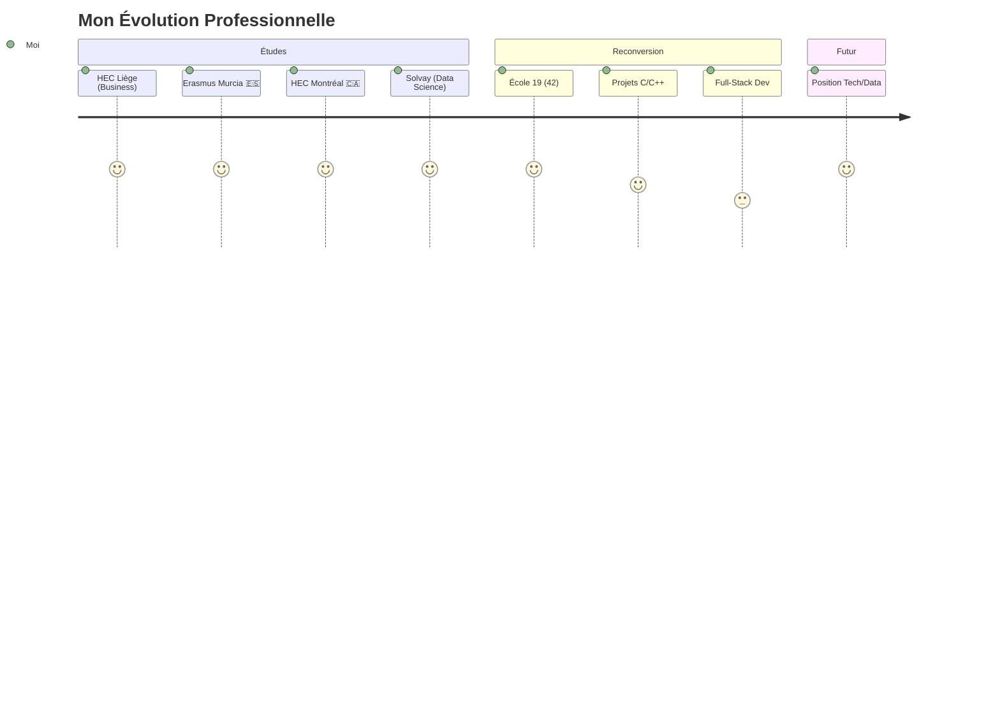

# 👋 Salut, moi c'est Ismael !

<div align="center">

;Building+bridges+between+business+%26+tech;Erasmus+%7C+Montréal+🇨🇦+%26+Murcia+🇪🇸)

[](https://linkedin.com/in/votre-profil)
[](https://github.com/ismaeljda)
[](mailto:votre.email@example.com)


</div>

---

## 🎯 Mon Parcours Unique

```python
class Developer:
    def __init__(self):
        self.nom = "Ismael"
        self.localisation = "Bruxelles, Belgique 🇧🇪"
        self.parcours = "Business Engineering → Code"
        self.status = "🚀 En reconversion | École 19 (42 Network)"
        
    @property
    def formation(self):
        return {
            "actuel": ["École 19 (42) - Computer Science", 
                      "Solvay Brussels School - M.Sc. Business Engineering (Data Science)"],
            "international": ["HEC Montréal 🇨🇦 (Triple accredited AACSB/EQUIS/AMBA)",
                            "Universidad de Murcia 🇪🇸 (Full Spanish immersion)"],
            "bachelor": "HEC Liège - B.Sc. Business Engineering"
        }
    
    @property
    def super_pouvoir(self):
        return "Transformer des problèmes business en solutions techniques élégantes"
    
    def __str__(self):
        return "Business mind meets coding hands 🧠💻"

ismael = Developer()
print(ismael)  # Business mind meets coding hands 🧠💻
```

### 💡 Ce qui me rend unique

- 🎓 **Double casquette** : Formation Business Engineering (Solvay) + Computer Science (École 42)
- 🌍 **Vision internationale** : Erasmus à Montréal (HEC) et Murcie - 3 pays, 3 cultures
- 📊 **Data Science** : Machine learning, forecasting, analytics appliqués au business
- 🔄 **Reconversion assumée** : De l'économie au code avec une vision stratégique intacte
- 🤝 **Expérience terrain** : 6 ans en logistics, admin, entrepreneurship

> *"Je ne code pas juste pour coder, je code pour résoudre des vrais problèmes business."*

---

## 🛠️ Stack Technique

<div align="center">

### 💻 Langages & Fondations École 42


### 📊 Data Science & Business Tools


### 🔧 Development & Infrastructure


</div>

---

## 🏆 Projets Académiques & Professionnels

### 📊 Machine Learning pour FNAC | Solvay Brussels School
> Prédiction du comportement client basée sur les intérêts de lecture

**🎯 Contexte :** Partenariat avec FNAC pour améliorer la recommandation personnalisée  
**💡 Approche :** Modèles de supervised learning sur données clients réelles  
**📚 Technologies :** Python • Scikit-learn • Pandas • Machine Learning

```
✨ Segmentation client avancée
🎯 Modèles prédictifs de cross-selling
📈 Amélioration du taux de conversion
🤝 Collaboration avec équipe Data FNAC
```

### 🔐 Serious Game Cybersécurité | Desjardins Bank (HEC Montréal)
> Création d'un jeu de sensibilisation pour 40,000+ employés

**🎯 Objectif :** Former les employés aux risques cyber de manière ludique  
**💡 Innovation :** Game design interactif avec scénarios réalistes  
**📚 Stack :** Game Design • Cybersecurity Awareness • UX

```
🎮 Gamification des formations
🔒 Scénarios de phishing et social engineering
📊 Tracking des performances d'apprentissage
👥 Adoption massive en interne
```

---

### 🎮 Pac-Man 3D | HEC Liège
> Jeu vidéo complet développé en C# avec Unity Engine

**🎯 Challenge :** Maîtriser le développement game avec Unity  
**💡 Réalisation :** Jeu 3D jouable avec IA des fantômes  
**📚 Technologies :** C# • Unity • 3D Graphics • AI Pathfinding

---

### 📈 Simulation Trading Bloomberg | HEC Montréal
> Portfolio management avec capital fictif de $100,000

**🎯 Compétition :** Gestion active sur plateforme Bloomberg  
**💡 Stratégie :** Analyse technique et fondamentale  
**📚 Outils :** Bloomberg Terminal • Portfolio Theory

---

## 🎓 Formations & Certifications

<table>
<tr>
<td width="60%" valign="top">

### 🎯 Formation Actuelle
**École 19 (42 Network)** | Oct 2024 - Oct 2025  
*Peer-to-peer learning, projets systèmes*
- Programmation système (C/C++)
- Algorithmes & structures de données
- Network programming
- Architecture logicielle

**Solvay Brussels School** | Sept 2022 - Jan 2025  
*Master in Business Engineering - Data Science*  
🏆 **Niveau : Cum Laude**
- Machine Learning & AI
- Business Strategy & Valuation
- Project Management
- Supervised Learning

</td>
<td width="40%" valign="top">

### 🌍 Expériences Internationales

**HEC Montréal** 🇨🇦  
*Dec 2023 - Mai 2024*  
- Cybersecurity project
- SAP & Google Analytics
- Bloomberg certification
- Portfolio management

**Universidad de Murcia** 🇪🇸  
*Sept 2021 - Fév 2022*  
Full Spanish immersion
- Marketing Research
- Business Strategy  
- HR Management
- Market study for Estrella beer

**HEC Liège** 🇧🇪  
*2019 - Juin 2022*  
Bachelor Business Engineering
- Web Development
- Applied Physics
- OOP Development

</td>
</tr>
</table>

---

## 💼 Compétences Transversales

<div align="center">

| 💻 Technique | 📊 Data & Business | 🧠 Soft Skills | 🌍 Langues |
|:-------------|:-------------------|:---------------|:-----------|
| System Programming | Machine Learning | Problem Solving | 🇫🇷 Français (natif) |
| Web Development | Data Analytics | Project Management | 🇬🇧 English (B2) |
| Algorithm Design | Business Valuation | Team Leadership | 🇪🇸 Español (fluent) |
| DevOps & Docker | Market Research | Adaptability | 🇳🇱 Nederlands (basic) |
| Version Control | Strategic Planning | Critical Thinking | |

</div>

---

## 📊 GitHub Activity

<div align="center">


</div>

---

## 🎯 Ce que je recherche

Je suis à la recherche d'opportunités où je pourrai **combiner mes compétences business et tech** :

- 💼 **Stage ou Junior Position** en Data Science, Software Development, ou Product Management

### 💪 Ce que j'apporte

✅ **Vision stratégique** : Je comprends les enjeux business derrière le code  
✅ **Rigueur analytique** : Formé à la fois en économie quantitative et en algo  
✅ **Adaptabilité** : 3 pays, 4 écoles, multiples domaines maîtrisés  
✅ **Communication** : Capable de parler aux business ET aux devs  
✅ **Expérience projet** : Collaborations avec FNAC, ULB, Desjardins, Perspective Brussels

---

## 📈 Mon Parcours en Graphique



## 📫 Me Contacter

<div align="center">

| 📧 Email | 💼 LinkedIn | 🐙 GitHub | 📍 Localisation |
|:---------|:-----------|:----------|:----------------|
| [ismaelsall526@gmail.com](mailto:ismaelsall526@gmail.com) | [Mon LinkedIn]([https://linkedin.com/in/votre-profil](https://www.linkedin.com/in/ismael-sall-8085a9243/)) | [@ismaeljda](https://github.com/ismaeljda) | Bruxelles, BE 🇧🇪 |

---

### 💬 *"From spreadsheets to algorithms, from business cases to code reviews"*

**🎯 Ouvert aux opportunités | Disponible immédiatement**

---

<sub>⚡ *"J'ai survécu à des peer-evaluations à l'École 42 et à des présentations devant des C-levels... Je suis prêt pour n'importe quel code review!"* 😄</sub>

</div>
